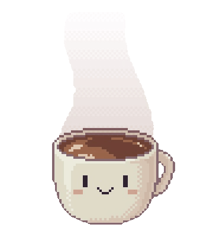

<!-- Topo com onda -->

 
   

<h1 align="center">Eai? Louise aqui</h1>

<h2 align="center">
  
  <!-- redes sociais-->

  <a href="https://www.linkedin.com/in/louisemorais/">
  <a href="mailto:louisemorais3@gmail.com">

 
</h2>
    
<h2 align="left">Sobre mim</h2> 

  
      
  

    
Sou estudante de Análise e Desenvolvimento de Sistemas no Senac,
    tenho interesse em atuar na área de desenvolvimento e conhecer novas tecnologias.
      
   -  🌱 Estou aprendendo Atualmente <strong>Java, Spring, PostgreSQL e React</strong> 
   -  ⚡ Fun fact: <strong>Curto desenhar</strong> 
    

  

<!-- minhas tecnologias que domino-->
<h3 align="left">Linguagens e Tecnologias:</h3>    

  

<!-- stats-->
<h3 align="left">Estatíticas do perfil:</h3> 

  
   
  

  

  <!-- GIF da pasta assets -->
  
  
  <!-- Frase em itálico -->
  
<strong><i>"Quando não estou codando, transformo café em arte"</i><strong> 

<!-- Rodapé com onda -->

 
  

<!--
**louisemorais/louisemorais** is a ✨ _special_ ✨ repository because its `README.md` (this file) appears on your GitHub profile.

Here are some ideas to get you started:

- 🔭 I’m currently working on ...
- 🌱 I’m currently learning ...
- 👯 I’m looking to collaborate on ...
- 🤔 I’m looking for help with ...
- 💬 Ask me about ...
- 📫 How to reach me: ...
- 😄 Pronouns: ...
- ⚡ Fun fact: ...
-->
